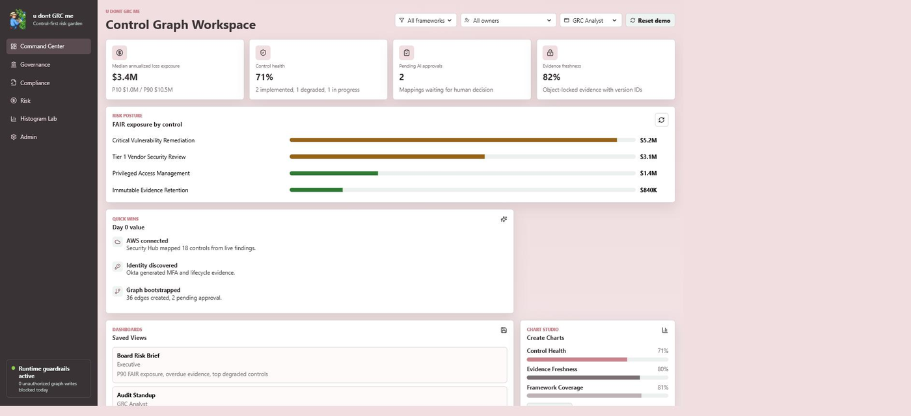

# u dont GRC me

A control-centric GRC product prototype. The app treats controls as the primary source of truth and maps assets, frameworks, evidence, risks, integrations, and AI agent decisions around each control.

**Live demo:** https://xnasusx.github.io/u-dont-grc-me/



Every number on that screen resolves back to a control. Loss exposure is a FAIR figure attached to a control, evidence freshness is measured against the control it proves, and framework coverage is a mapping from a requirement onto the same control. That is the whole thesis: build the control layer properly and audit evidence, risk, policy, and compliance compose off it instead of being maintained five separate times.

## Run locally

```powershell
npm install
npm run dev:full
```

Open http://127.0.0.1:5173/.

The full local mode starts:

- React/Vite UI on http://127.0.0.1:5173
- SQLite-backed API on http://127.0.0.1:8787

For static UI-only work, run `npm run dev -- --port 5173`.

To package the hosted API Lambda:

```powershell
npm run package:lambda
```

## Hosted Prototype

The GitHub Pages frontend at https://xnasusx.github.io/u-dont-grc-me/ is the public entry point. Behind it:

- An AWS CloudFront distribution mirrors the same build.
- The CloudFront origin is a private S3 bucket with public access blocked; it is reachable only through the distribution.
- A Lambda function URL serves the read-only Governance API, backed by DynamoDB for the Governance snapshot.

The hosted API stays read-only from the public app until authenticated mutation workflows are added. Endpoint hostnames are supplied at build time through `VITE_API_BASE_URL` rather than committed here — see [`docs/DEPLOYMENT.md`](docs/DEPLOYMENT.md).

## Build

```powershell
npm run build
```

GitHub Pages builds set `GITHUB_PAGES=true` and `VITE_API_BASE_URL` so Vite emits assets under `/u-dont-grc-me/` and loads Governance data from the hosted Lambda/DynamoDB API. The default build stays rooted at `/` for CloudFront/S3.

To preview a Pages build locally, set the same env var so `vite preview` serves under the
matching base — otherwise the absolute `/u-dont-grc-me/` asset paths in `dist/index.html`
fall through to the SPA fallback and the page renders blank:

```powershell
$env:GITHUB_PAGES="true"; npm run preview
```

## Machine-readable artifacts

The build publishes three static artifacts alongside the app, regenerated by script and
committed:

| Artifact | Script | Served at |
| --- | --- | --- |
| OSCAL component-definition | `npm run export:oscal` | `/oscal/component-definition.json` |
| SCF coverage snapshot | `npm run export:scf-coverage` | `/scf/coverage.json` |
| Agent index (`llms.txt`) | hand-maintained | `/llms.txt` |

`export:oscal` emits the control inventory as [OSCAL](https://pages.nist.gov/OSCAL/) 1.1.2:
each control becomes a `process` component, and each framework mapping an
`implemented-requirement` carrying coverage percentage, mapping confidence, and approval
state. UUIDs are RFC 4122 v5 over a fixed namespace and `last-modified` is derived from
the newest control row, so an unchanged database re-exports byte-identically and the diff
stays reviewable.

`llms.txt` follows the [llms.txt standard](https://llmstxt.org) and indexes the hosted
surfaces, the API routes, and data provenance for agents.

## Current Product Slice

- Command Center: executive metrics, global filters, saved dashboard views, chart creation, and Monte Carlo scenario simulation.
- Governance: API-backed control inventory, module tabs, control detail, framework mapping matrix, SCF coverage comparison, evidence health, blueprint library, policy traceability, asset scope, graph data model rules, and control-adjacent graph view.
- Compliance: audit readiness, audit package assembly, AI approval queue, evidence review simulator, immutable-reference metadata, and `PROVED_BY` graph edges.
- Risk: risk register, control-linked FAIR scenarios, 10,000-trial Monte Carlo calculator, histogram, five-number summary, expected value, loss exceedance view, evidence nutrition labels, calibration anchors, data-vetting checklist, SME elicitation, and human approval controls.
- Admin: integrations, knowledge system, third-party risk, nth-party discovery, remediation playbooks, SaaS hardening library, RBAC/trust controls, agent operations, service accounts, allow-lists, deny-lists, and graph mutation audit events.

## Upstream open source content

Three open source projects feed the product. All are synced by script into generated
files that are committed, so the hosted build needs no network access at runtime. See
[THIRD-PARTY-NOTICES.md](THIRD-PARTY-NOTICES.md) for attribution.

### Secure Controls Framework (scf-api)

```powershell
npm run sync:scf
npm run export:scf-coverage
```

Ingests [scf-api](https://github.com/GRCEngClub/scf-api) into `data/scf/catalog.json`,
which seeds the `scf_controls` and `scf_framework_map` tables. Governance > SCF Coverage
then answers the question the mapping matrix cannot: for each requirement we track, how
many SCF controls crosswalk to that citation, and how many of our own controls actually
claim it. A requirement with SCF suggestions and zero active mappings is unclaimed
coverage.

Eight crosswalks are ingested, covering all seven frameworks the product models: AICPA
TSC, ISO 27001, ISO 27002, NIST CSF 2.0, HIPAA Security Rule, PCI DSS 4.0.1, EU GDPR,
and ISO 42001. ISO 27001 needs two crosswalks because the 2022 standard covers only
management clauses 4-10, while our Annex A citations (A.5.16, A.8.8, A.8.24) are
crosswalked under ISO 27002.

Citation styles differ between our seed data and SCF, so requirements resolve in two
passes: exact match after dropping the ISO `A.` prefix, then prefix match for
regulations we cite more coarsely than SCF does (`164.312(a)` widening to
`164.312(a)(1)`). Exact matches never fall through to the prefix pass.

Upstream `api/controls.json` is ~14MB; the sync keeps only the 732 controls the ingested
crosswalks reference, so the committed catalog stays around 650KB.

**SCF content is CC BY-ND.** Titles and descriptions are reproduced verbatim and must
never be rewritten, paraphrased, or merged. Attribution is shown in the panel itself.

`npm run export:scf-coverage` writes `public/scf/coverage.json`. The hosted Lambda does
not serve `/api/scf/coverage`, so on GitHub Pages the client falls back to that static
snapshot; local `dev:full` uses the live route and reflects database edits immediately.

### SaaS Hardening Library (how-to-harden)

```powershell
npm run sync:hardening
```

Pulls [how-to-harden](https://github.com/grcengineering/how-to-harden) at a pinned commit
and generates `src/hardeningData.ts` (121 platforms, 1,334 controls). Two upstream tiers
are joined and labelled distinctly in the UI:

- **Control packs** (`packs/<vendor>/controls/*.yaml`) - full definitions with SOC 2 /
  NIST 800-53 / ISO 27001 / PCI DSS citations, machine-readable audit checks, and
  API/Terraform remediation. Upstream currently ships these for GitHub and Okta only.
- **Guide sections** (`docs/_guides/*.md`) - heading, profile level, and framework
  citations for the remaining platforms.

Artifact availability per control (terraform / api / cli / siem / db / sdk / config) is
derived from the upstream pack tree, so a control with a Terraform pack can be treated as
`Fully Automated` rather than `Manual`. Pack bodies are not vendored.

The generated module is ~1.7MB, so it is dynamically imported and code-split out of the
initial bundle; it loads only when the Admin view renders.

Bump `REF` in `scripts/sync-hardening-packs.mjs` (or set `HOW_TO_HARDEN_REF`) to track a
newer upstream commit.

### Nth-Party Discovery (nthpartyfinder)

```powershell
npm run sync:nthparty
```

Ingests [nthpartyfinder](https://github.com/grcengineering/nthpartyfinder) scan output into
`src/nthPartyData.ts`, surfacing 3rd/4th/Nth-party vendor relationships discovered from
public DNS, certificate transparency, trust-center subprocessor pages, and web traffic.

List authorized domains in `data/nth-party/targets.json`:

```json
{ "targets": [{ "domain": "example.com", "depth": 1, "timeoutSeconds": 1800 }] }
```

If the `nthpartyfinder` binary is on PATH (`brew install nthpartyfinder`,
`cargo install nthpartyfinder`, or the Docker image) the script scans each target and
writes `data/nth-party/<domain>.scan.json`. Otherwise it ingests whatever `*.scan.json`
files are already there, so scans run elsewhere can simply be committed. The panel shows
an empty state until a scan lands.

Only scan domains you are authorized to assess.

## Documentation

| Document | What it covers |
| --- | --- |
| [`docs/USER_GUIDE.md`](docs/USER_GUIDE.md) | Walking the app view by view |
| [`docs/DEVELOPER_GUIDE.md`](docs/DEVELOPER_GUIDE.md) | Architecture, data model, and how to extend it |
| [`docs/DEPLOYMENT.md`](docs/DEPLOYMENT.md) | Building and deploying to Pages, CloudFront, and Lambda |
| [`docs/IMPLEMENTATION_PLAN.md`](docs/IMPLEMENTATION_PLAN.md) | The plan of record for feature work |
| [`docs/ROADMAP.md`](docs/ROADMAP.md) | Where the product is going |
| [`docs/PORTFOLIO.md`](docs/PORTFOLIO.md) | Building and publishing the portfolio page in `portfolio/` |
| [`CONTRIBUTING.md`](CONTRIBUTING.md) | How to work in this repo |
| [`SECURITY.md`](SECURITY.md) | Reporting a vulnerability |
| [`CHANGELOG.md`](CHANGELOG.md) · [`RELEASE_NOTES.md`](RELEASE_NOTES.md) | What shipped, and when |
| [`THIRD-PARTY-NOTICES.md`](THIRD-PARTY-NOTICES.md) | Attribution for vendored upstream content |

## Implementation Plan

The GitHub source of truth for the implementation plan is `docs/IMPLEMENTATION_PLAN.md`. Future feature work should update that file and pass a PMO check against it before release.

## Local persistence

The app now has local and hosted state paths:

- Governance inventory and mappings load from the hosted Lambda/DynamoDB API on CloudFront and from the SQLite-backed API in local `dev:full` mode.
- Other prototype actions still use `localStorage` through `src/store.ts` as an API-shaped state layer.

Modeled operations:

- `approveMapping`: turns AI-proposed mappings into approved or rejected graph edges.
- `ingestEvidence`: creates an evidence record and a `PROVED_BY` edge from the selected control.
- `connectIntegration`: updates integration state and records the action in the audit ledger.
- `resetWorkspace`: restores the seeded demo state.

## Backend handoff target

The local backend uses Node's built-in SQLite driver:

- `server/schema.sql`: relational data model for controls, frameworks, requirements, mappings, assets, policies, evidence blueprints, evidence items, and graph relationships.
- `server/database.js`: initialization, seed data, parameterized reads/writes.
- `server/api.js`: local HTTP API with `/api/health`, `/api/governance`, `/api/controls/:id`, and `POST /api/controls`.
- `server/lambda.js`: hosted read-only Lambda API for `/api/health` and `/api/governance`.
- `server/governance-seed-snapshot.json`: generated seed snapshot stored in DynamoDB on first hosted read.
- `scripts/package-lambda.ps1`: reproducible Lambda package build.

The next production step is replacing remaining `src/store.ts` operations with authenticated service calls:

- Graph database API for controls, nodes, edges, mappings, and control health.
- Evidence API with object-locked storage references and version IDs.
- Agent orchestration API with schema validation, allow-listed mutations, and audit logging.
- FAIR risk service for simulations and risk scenario updates.

## License

[GNU AGPL v3 or later](LICENSE) — copyright (c) 2026 Susan Shepard. If you modify this and
run it as a network service, the AGPL requires you to offer your users the modified source
under the same terms.

The AGPL covers this project's own code only. Vendored upstream content is not relicensed
and keeps its own terms — in particular the Secure Controls Framework text under
`data/scf/` is CC BY-ND 4.0, which does not permit modified redistribution. See
[THIRD-PARTY-NOTICES.md](THIRD-PARTY-NOTICES.md).
